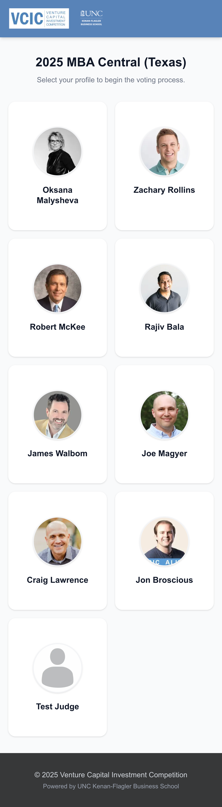
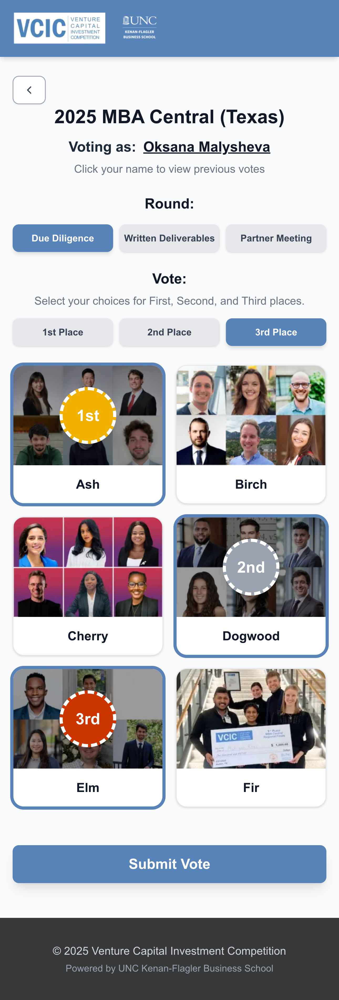
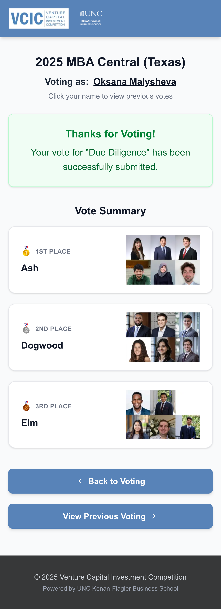
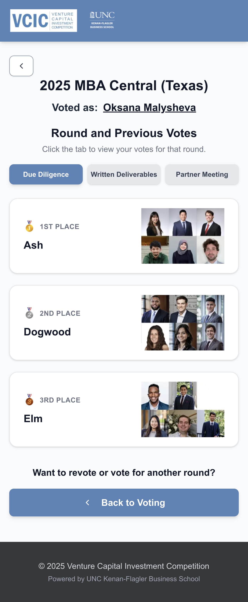
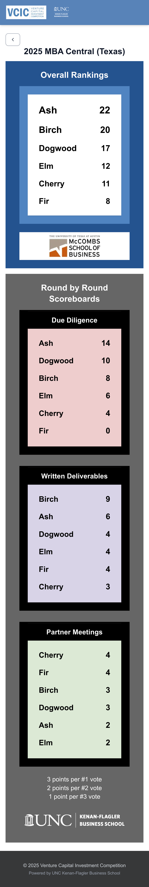
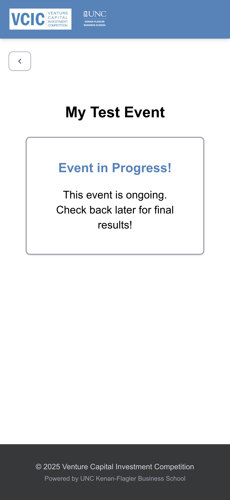
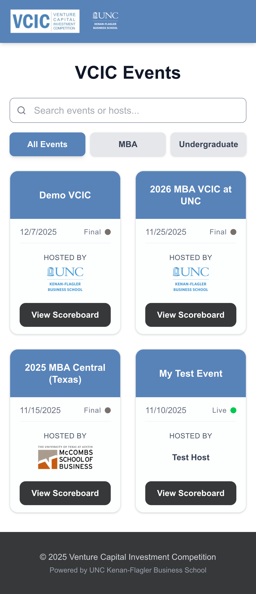
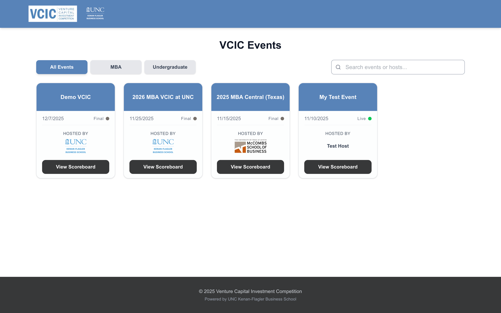
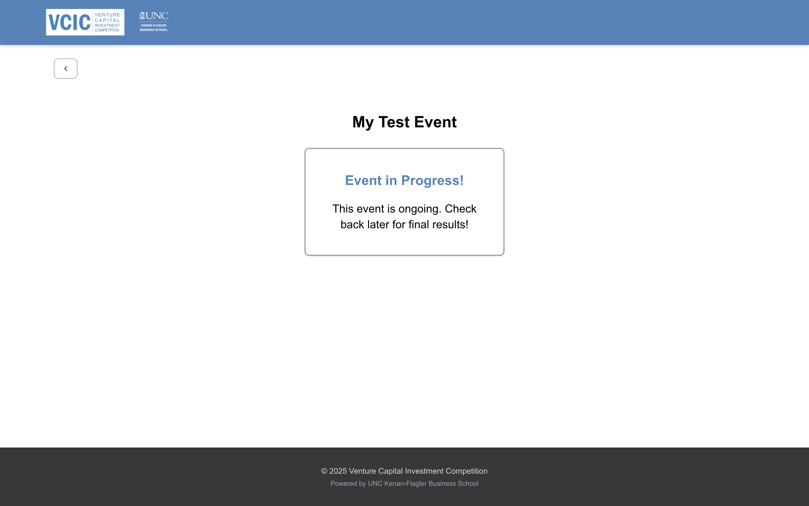
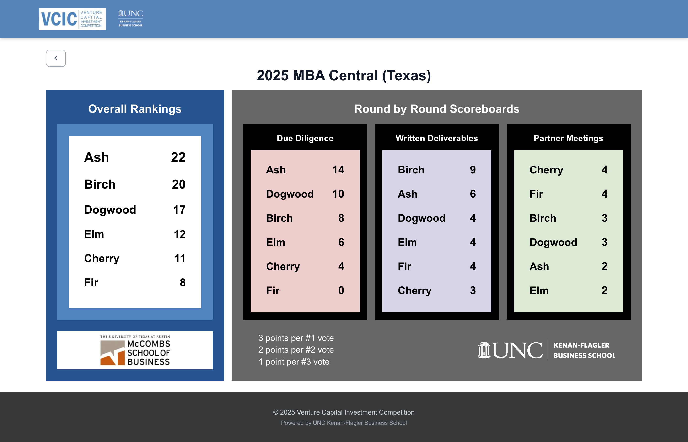

# VCIC Scoring System


**[Live Demo](https://youtu.be/RZFGFcdve2Q)** | **[User & Admin Guide](https://docs.google.com/document/d/1PCzh7lQViEAFcz4EZP-7Io4vAhMRTzmxpErGJK3AuKE/edit?usp=sharing)**

## 📖 Overview

The **VCIC Scoring System** is a modern, mobile-first web application designed to digitize the voting and scoring process for the Venture Capital Investment Competition (VCIC).

This system utilizes **Google Sheets as the database**. This allows non-technical event organizers to manage events, teams, and live scores using the spreadsheet interface they are already familiar with, while providing a polished, responsive frontend for judges and the public.

## ✨ Key Features

- **Mobile-First Design:** Judges can vote for teams directly from their smartphones using a secure, event-specific link.
- **Real-Time Sync:** Judge votes are written directly to Sheets; scoreboards update instantly.
- **"1 + N" Database Architecture:** A single "Master Index" sheet manages an unlimited number of individual "Event Sheets."
- **Live vs. Final Scoreboards:** Public scoreboards show an "Event in Progress" message while voting is live and automatically reveal detailed rankings when the admin toggles the status to "Final."
- **Smart Validation:** Prevents judges from selecting the same team for multiple ranks in a single round. Prevents judges from submitting incomplete votes.
- **Automated Admin Dashboard:** Includes automated checks to see which judges have submitted votes for each round.

## 🏗️ Architecture

The application connects a **Next.js frontend** (hosted on Vercel) to **Google Sheets** via a Google Service Account. The system architecture follows a **1 + N** Sheets model:

1.  **Master Index (1):** A single sheet acting as the registry. It routes traffic (`/scoreboard/[event_id]`) to the correct Google Sheet ID and controls the `Live` (hidden) vs `Final` (visible) status.
2.  **Event Sheets (N):** Each event gets its own copy of a template sheet containing tabs below:
    - `teams` & `judges` (Metadata)
    - `votes_data` (Raw inputs, the "database" for voting data)
    - `VotesView` (Human-readable version of the `votes_data`)
    - `Scoreboard` (Calculated rankings)
    - `Votes-to-Points` (Summary table of each judge's vote for each round)
    - `JudgeStatus` (Quick view of whether each judge has voted for each round)

## 📸 Screenshots

<details>
  <summary><b>📱 View Mobile Screenshots</b> (Click to expand)</summary>

### Judge Voting Flow

|                   Judge Selection                   |               Judge Voting                |
| :-------------------------------------------------: | :---------------------------------------: |
|      |  |
|                  Vote Confirmation                  |               Vote History                |
|  |  |

### Scoreboard and Event Home Views

|              Scoreboard (Final)              |                       Scoreboard (Live)                       |            Event Home Page            |
| :------------------------------------------: | :-----------------------------------------------------------: | :-----------------------------------: |
|  |  |  |

</details>

<details>
  <summary><b>💻 View Desktop Screenshots</b> (Click to expand)</summary>

### Judge Voting Flow (Desktop View)

|                       Judge Selection                       |                   Judge Voting                    |
| :---------------------------------------------------------: | :-----------------------------------------------: |
|      |  |
|                      Vote Confirmation                      |                   Vote History                    |
|  |  |

### Events & Scoreboards (Desktop View)

|             Event Home Page (Desktop)              |             Live Status Message (Desktop)             |
| :------------------------------------------------: | :---------------------------------------------------: |
|  |  |

|                  Final Scoreboard (Desktop)                  |
| :----------------------------------------------------------: |
|  |

</details>

## 🚀 Getting Started

### Prerequisites

- **Node.js** 18 or later (npm included), **Git**, **React** 19 or later, **Tailwind CSS** v4.1 or later, **Shadcn UI**, **Lucide Icons**, **Google Sheet API** v4
- **Google Cloud Service Account** with Editor access to the Drive folder and Sheets.

### Installation

1.  **Clone the repository:**

```bash
 git clone https://github.com/VCIC-Scoring-System/vcic-scoring-system.git
```

2.  **Install dependencies:**

```bash
  cd vcic-scoring-system
  npm install
```

3.  **Configure the Environment Variables**

Create a `.env.local` file in the root directory. You will need the following keys:

| Variable                  | Description                                                               |
| :------------------------ | :------------------------------------------------------------------------ |
| `GOOGLE_CLIENT_EMAIL`     | Service Account email address.                                            |
| `GOOGLE_PRIVATE_KEY`      | Service Account private key (use `\n` for newlines).                      |
| `MASTER_INDEX_SHEET_ID`   | Spreadsheet ID of the Master Index (1 sheet).                             |
| `EVENT_SHEET_TEMPLATE_ID` | Spreadsheet ID for the Event Sheet Template used for creating new events. |
| `GOOGLE_DRIVE_FOLDER_ID`  | Drive folder ID where new event sheets are saved.                         |
| `ADMIN_TOKEN`             | A secure string used to authenticate Admin API requests.                  |

4.. **Run the development server:**

```bash
  npm run dev   # http://localhost:3000
```

Open http://localhost:3000 to view the local host app.

## 🎮 Production

**[User & Admin Guide](https://docs.google.com/document/d/1PCzh7lQViEAFcz4EZP-7Io4vAhMRTzmxpErGJK3AuKE/edit?usp=sharing)**

### For Administrators

**1. Creating an Event (Manual Method)**

- Duplicate the **Event Sheet Template** sheet in Google Drive.
- Add a row to the **Master Index** with `event_name`, the new `sheet_id`, `event_type` (MBA/Undergraduate), `event_date` (mm/dd/yyyy), `host_name`, `host_logo_url`, and `status` (Live/Final).
- Complete the `teams` and `judges` tabs in your new sheet.

**2. Distributing Links**

- Construct links manually: `https://vcic-scoring-system.vercel.app/voting/[sheet_id]`

**3. Publishing Results**

- Go to the **Master Index** sheet.
- Change the `status` column from **Live** to **Final**.
- The public scoreboard will immediately reveal the winners.

### For Judges

- **Access:** Click the unique link provided by the organizer. No login or passwords required.
- **Vote:** Tap a round (e.g., "Due Diligence"), select a rank (e.g., "1st Place"), and tap a team. Repeat this process for all 3 places, and click the "Submit Vote" button.
- **Review:** Click the underlined name at the top to view previously submitted votes.

## 📦 Deployment

This project is optimized for **Vercel**.

1.  Push your code to GitHub.
2.  Import the project into Vercel.
3.  **Critical Setting:** Set the Root Directory to `vcic` (not the default `./`).
4.  Add the **Environment Variables** (from `.env.local`) in the Vercel Project Settings.
5.  Deploy.

## 🤝 Contributing

Issues and pull requests are welcome. Please keep edits focused on the Sheets-driven workflow documented above and include updates to `docs` (NOT the one inside of `vcic` folder) when behavior changes.

## License

Distributed under the MIT License. See [MIT License](LICENSE) for more information.
